# Results

Figures from the committed notebook runs. Everything here is regenerated when the
notebooks are re-run — [alpha_backtest.ipynb](../Notebooks/alpha_backtest.ipynb)
writes the backtest figures, [build_dataset.ipynb](../Notebooks/build_dataset.ipynb)
writes the data-hygiene ones.

The mean-variance book delivers a **net Sharpe of ~0.83** on the walk-forward
out-of-sample period (gross ~1.13), after liquidity-scaled costs (σ/√ADV, 10 bps
for the median-liquidity name) on every rebalance. Max drawdown net of costs is
around −7%. Read the Sharpe alongside the signal, though: the traded signal's
out-of-sample IC is only **+0.010 (t ≈ 1.3)**, so the return is largely
construction- and regime-driven rather than proven forecast skill — the
rolling-IC and coefficient-stability panels below are where that shows up.

## Backtest

### Equity curves

Three portfolio construction levels compared gross (top panel), then the
mean-variance book gross vs. net of 10 bps costs (middle), with its drawdown
(bottom). The gap between gross and net is the cost model in action — costs are
non-trivial but the strategy remains profitable after them.

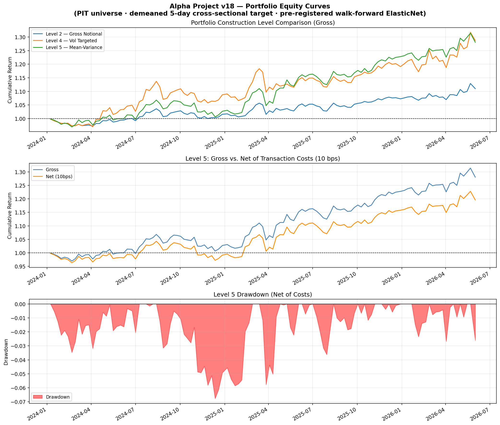

### Factor exposure — raw vs neutralized

The traded signal regressed cross-sectionally on style factors. The raw signal
carries large loadings on **long-horizon momentum (−0.62)** and **volatility
(+0.43)** — it is mostly a factor bet. Neutralizing collapses every exposure to
~0 (and mean IC from +0.0095 to +0.0029), so the residual idiosyncratic edge is
negligible.

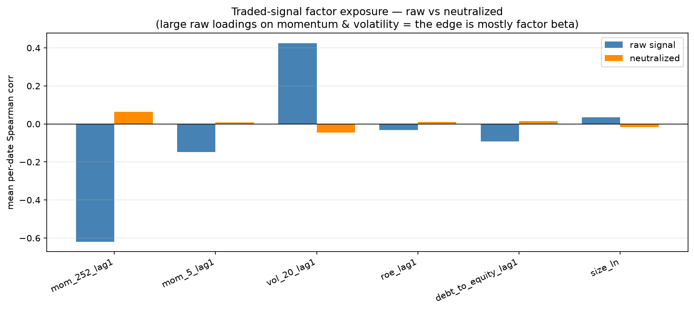

### Net equity curves — raw vs factor-neutral vs Level 6

Level 5 (raw signal) and Level 6 (√-impact priced inside the optimiser) track
each other closely to ~+12% net; the **factor-neutral** book drifts to ~−2%,
the clearest statement that the return is harvested style premia, not alpha. At
a $100M book Level 6 sits within optimizer noise of the ex-post √-impact charge
— the penalty only bites at larger AUM.

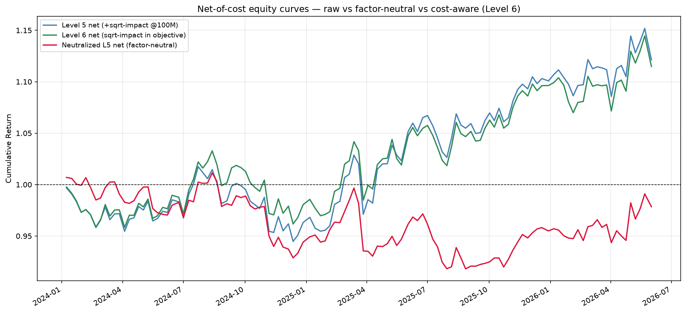

### Rolling information coefficient

Daily Spearman IC of the traded signal with a 20-day rolling mean. The IC is
noisy day-to-day (as expected for a weekly-horizon cross-sectional signal) but
trends positive on the rolling average. The absence of a suspiciously smooth
upward drift is itself a good sign — that pattern usually indicates leakage.

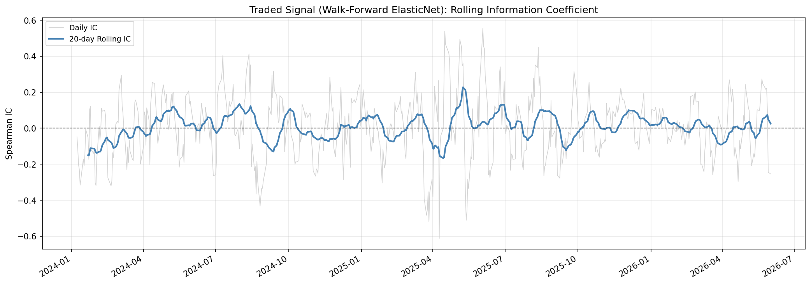

### Coefficient stability

ElasticNet coefficients across walk-forward windows. Features that flip sign
window-to-window aren't carrying stable information; the ones that persist
(short-term reversal, short-pressure) match the pre-registered hypotheses.

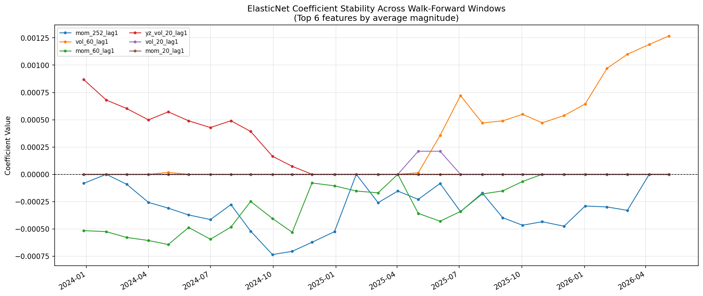

### Feature importance

Random-forest importances over the same feature set, as a non-linear
cross-check on which families matter.

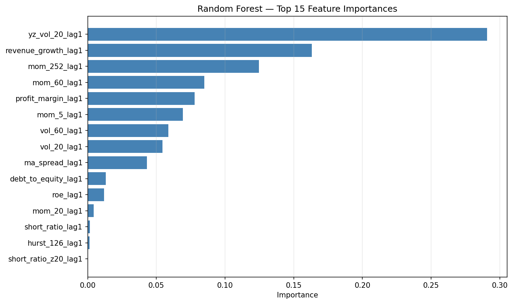

## Data hygiene

These come from the dataset build and exist to catch the boring failure modes
before any modelling happens.

### Point-in-time universe

Universe size over time from the historical constituents-and-changes file —
each date only sees that day's actual index members.

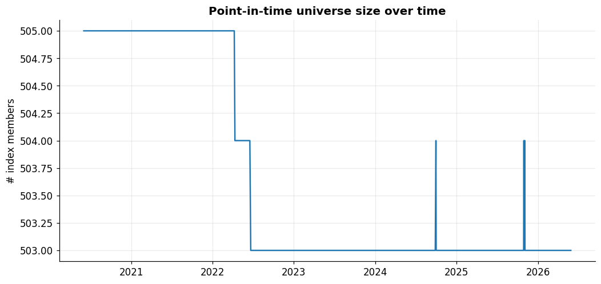

### Survivorship coverage

How many of the delisted/removed names Yahoo actually returned data for. The
gap is *residual* survivorship bias — measured rather than assumed away.

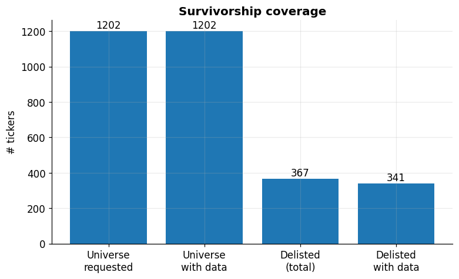

### Feature coverage

Non-null rate per feature over time. A feature whose coverage silently dies is
a dead data pipe, and this heatmap is where it shows up.

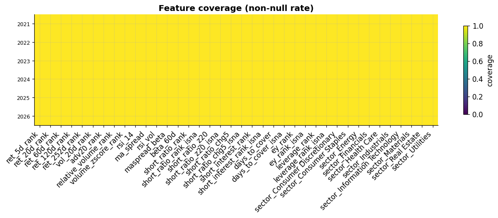

### Observations per date

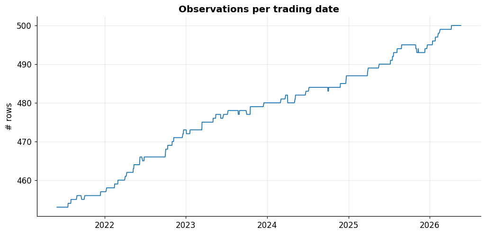

### Feature correlation

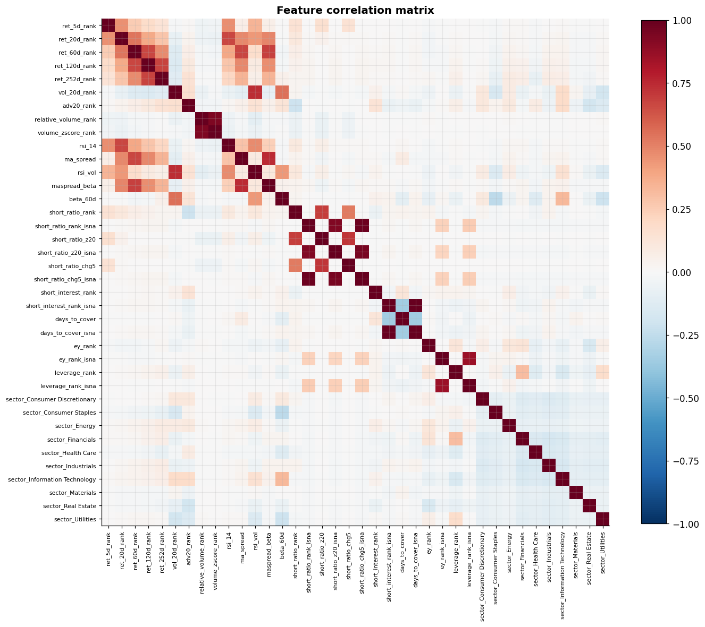

### Feature distributions

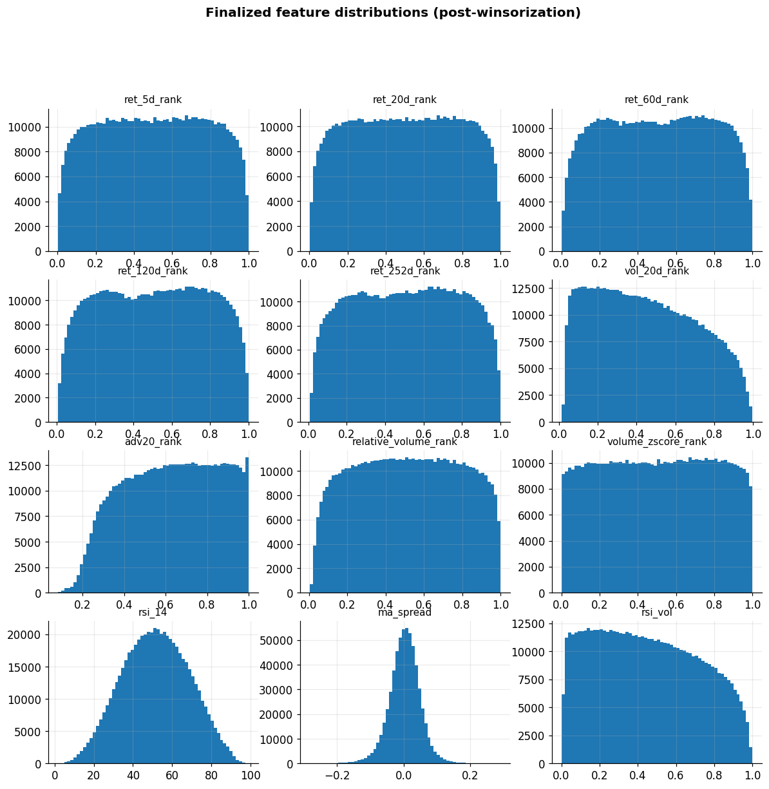

### Target sanity

Daily cross-sectional mean of the demeaned target — should hover at zero by
construction, and does.

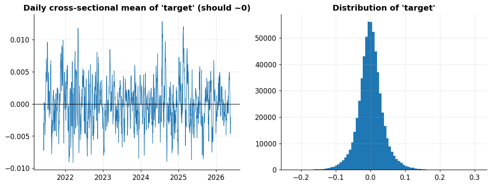
